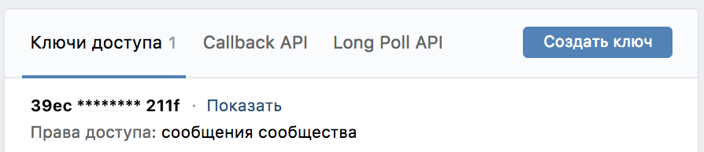
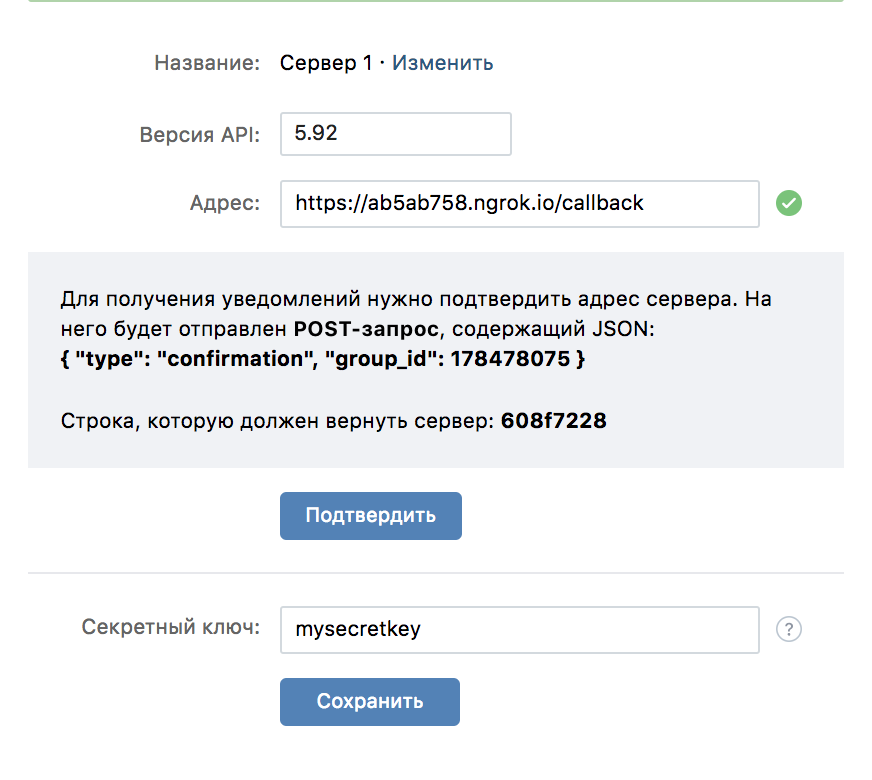
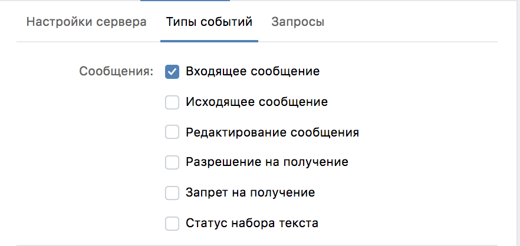

# ComeOutBot
## Описание
Бот, который при упоминании фразы stride-bot в сообщении (чувствителен к регистру), пересылает пользователю текст этого сообщения.
## Использование
Конфигурация бота находится в файле application.properties 

Перед использованием необходимо [загрузить и установить ngrok](https://ngrok.com/download) и указать для ngrok token, полученный на [сайте](https://dashboard.ngrok.com/get-started):
```
./ngrok authtoken <YOUR_AUTH_TOKEN>
```
С помощью команды пробросить порт (пример: 80), на котором будет отвечать callback:
```
./ngrok http 80
```
Для тестирования бота необходимо:
- Создать сообщество ВКонтакте
- Перейти на страницу управления сообществом
- Перейти в пункт меню 'Работа с API'



- Получить token доступа ('создать ключ'), указать его в поле app.vk.api.token в application.properties. Он необходим для отправки сообщений ботом при доступе к ВК API.
```
app.vk.api.token=39ecbexamplefasfad50d02d79examplebfas3da1b4540cfe97b4example09af7091a172d211f
```
- Перейти на вкладку CallBack API, указать версию API 5.92 и https адрес на ngrok, как в примере на скриншоте (бот по умолчанию отвечает на URI /callback).



- Придумать и указать ВКонтакте secretKey. Такой же secretKey указать в поле app.vk.callback.secretKey
```
app.vk.callback.secretKey=mysecretkey
```
- Установить ID группы ВК в application.properties
```
app.vk.api.group=178478075
```
- Установить код подтверждения в application.properties (для подтверждения CallBack сервера)
```
app.vk.callback.confirmationCode=608f7228
```
- Перейти на вкладку 'типы событий' и включить уведомление о новых входящих сообщениях 



- Запустить Spring Boot приложение и подтвердить CallBack сервер для ВКонтакте (приложение ответит на тестовый запрос ВК кодом подтверждения confirmationCode)
- После этого ВК  начнет уведомлять CallBack сервер о событиях (входящих сообщениях), на которые бот будет отвечать при упоминании. Далее можно написать в ЛС сообщества, и бот ответит, если в сообщении будет присутствовать кодовая фраза stride-bot